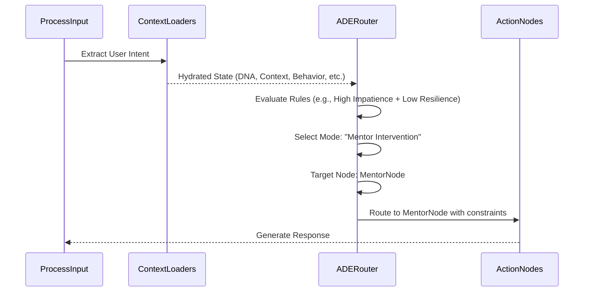

# AI Decision Engine Specification (ADES)

## 1. Purpose
The AI Decision Engine (ADE) acts as the central intelligence hub and single source of truth for conversational routing within the Tutor Graph. Instead of scattering conditional logic across various agents and nodes, the ADE synthesizes all context (Learning DNA, Context, Memory, Behavior Signals, Mission progress, and current Diagnosis) to output a deterministic decision on what Astra should do next and which Tutor Mode to activate.

## 2. Architecture
The ADE operates as a complex router and policy engine at the core of the LangGraph orchestration. 

### Inputs (The Synthesis State)
- **Learning DNA**: (e.g., visual learner, low resilience)
- **Learning Context**: (e.g., Exam prep vs. Open curiosity)
- **Memory**: (Recent working memory concepts + retrieved episodic misconceptions)
- **Behavior Signals**: (e.g., high impatience detected by Meta-Learning)
- **Learning Mission**: (Current active milestone)
- **Diagnosis**: (User's current understanding of the immediate problem)
- **Tutor Modes**: (Available personas/strategies: Socratic, Direct, Evaluator, Mentor, etc.)

### The Engine
The engine evaluates these inputs against a prioritized set of heuristic rules and, when ambiguity exists, an LLM-based policy evaluator. 

### Outputs
- **Selected Target Node**: Which node executes next (e.g., `GenerateHint`, `TriggerReflection`, `MentorIntervention`).
- **Configured Tutor Mode**: The exact system prompt/persona to use.
- **Constraints**: Specific bounds for the response (e.g., "max_length: short", "allow_direct_code: false").

## 3. Database Changes
- `decision_logs` table:
  - `id`, `session_id`, `turn_id`, `inputs_snapshot` (JSON), `decision_output` (JSON), `timestamp`
  - *Purpose*: For tracing, debugging, and offline evaluation of the Decision Engine's effectiveness.

## 4. LangGraph Integration
- **Node**: `DecisionEngineRouter`
- This node replaces decentralized `ConditionalEdges`. Every major turn in the graph cycles back through the `DecisionEngineRouter` to determine the next step.
- Example graph flow: `ProcessInput` -> `LoadContexts` -> `DecisionEngineRouter` -> `[Target Action Node]` -> `Output`

## 5. API Changes
- `GET /api/v1/decisions/trace/{turn_id}`: Retrieve the exact variables and rules that led to a specific AI routing decision. (Primarily for admin/debugging).

## 6. Folder Structure
```
app/
  ai/
    decision_engine/
      __init__.py
      router.py           # LangGraph routing logic
      policy_rules.py     # Heuristic fallbacks and hard constraints
      synthesizer.py      # Combines states for the LLM policy evaluator
```

## 7. Sequence Diagrams



## 8. State Transitions
- `HYDRATE_STATE` -> `DECISION_ENGINE`
- `DECISION_ENGINE` -> `EXECUTE_TUTOR_MODE` | `EXECUTE_MENTOR_INTERVENTION` | `TRIGGER_REFLECTION`
- `[ANY_ACTION]` -> `AWAIT_USER_INPUT`

## 9. Acceptance Criteria
- [ ] All LangGraph conditional routing logic is centralized within the Decision Engine.
- [ ] The engine successfully overrides default tutoring behavior when critical behavior signals (e.g., extreme frustration) are detected.
- [ ] Decision logic is fully deterministic based on the injected state, allowing for reproducible test cases.
- [ ] Every routing decision is logged for tracing and evaluation.
