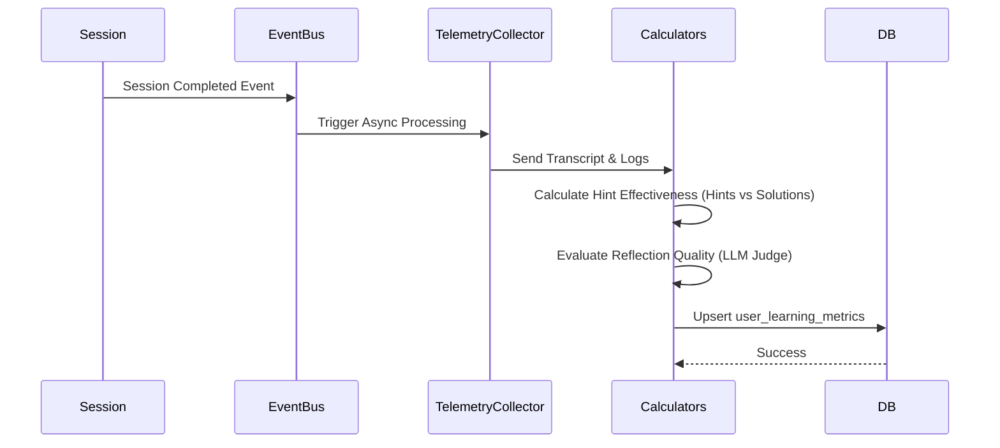

# AI Evaluation Framework (AEF)

## 1. Purpose
The AI Evaluation Framework (AEF) defines how Astra's educational efficacy and long-term intelligence are quantitatively and qualitatively measured. Unlike standard chatbot metrics (latency, token usage, user rating), AEF tracks deep learning outcomes. It ensures that Astra is genuinely teaching users, reducing their dependency on the AI over time, and improving their core skills.

## 2. Core Metrics
The framework calculates the following metrics continuously over a user's lifecycle:

1. **Hint Effectiveness**: The percentage of hints that lead directly to the user solving the problem vs. requiring another hint.
2. **AI Dependency Reduction**: Measuring if a user requires fewer hints or fewer interactions to solve similar problems in subsequent sessions.
3. **Reflection Quality**: Sentiment and semantic depth analysis of user reflections post-session (e.g., are they demonstrating synthesis?).
4. **Concept Retention**: Success rate when a previously mastered concept is re-introduced in a later Milestone or Challenge.
5. **Learning Velocity**: Time taken to progress through Milestones within the Learning Mission Engine.
6. **Independent Problem Solving**: The ratio of code written/problems solved by the user vs. code generated by the AI.
7. **Curiosity Growth**: The frequency of user-initiated "tangent" questions or deep-dive requests beyond the immediate task.
8. **Mentor Intervention Reduction**: The decrease in negative behavior signals (e.g., impatience) over time, indicating improved learning habits.

## 3. Architecture
The AEF relies on background data pipelines processing the logs generated by the Decision Engine, the Meta-Learning Engine, and Episodic Memory.

### Components
- **Telemetry Collector**: Intercepts session events (hints given, code compiled, errors thrown).
- **Metric Aggregator**: A background CRON/worker that calculates rolling averages for the core metrics.
- **Evaluation Dashboard**: Internal admin views and anonymized aggregated reports to gauge overall system health.

## 4. Database Changes
- `user_learning_metrics` table:
  - `user_id`, `metric_name`, `value` (float), `calculated_at`
- `evaluation_logs` table:
  - `id`, `session_id`, `hint_effectiveness_score`, `dependency_score`, `reflection_score`

## 5. System Integration
- **Post-Session Pipeline**: When a session ends, an asynchronous task is queued to analyze the transcript.
- LLM-as-a-Judge: Some qualitative metrics (like Reflection Quality) use a specialized LLM prompt to grade the user's reflection on a 1-5 scale based on cognitive depth.

## 6. Folder Structure
```
app/
  analytics/
    evaluation/
      __init__.py
      collectors.py       # Event listeners for telemetry
      calculators.py      # Logic for computing Dependency, Velocity, etc.
      llm_judges.py       # Prompts and logic for qualitative grading
```

## 7. Sequence Diagrams



## 8. Acceptance Criteria
- [ ] The system accurately calculates Hint Effectiveness based on interaction sequences.
- [ ] LLM-as-a-Judge can reliably grade reflection quality with consistent scoring criteria.
- [ ] All metrics are aggregated per user and stored in the database without blocking the active chat thread.
- [ ] Decreasing AI dependency is quantifiable and visible in long-term data over multiple sessions on similar topics.
