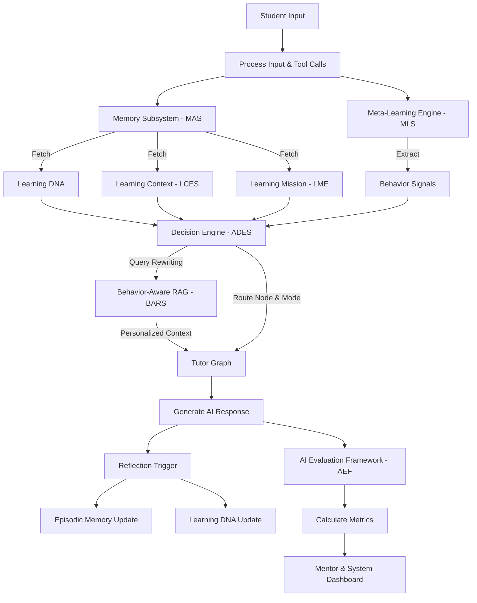

# Architecture Freeze v1.0

**Version Number:** 1.0  
**Approval Date:** 2026-07-15  
**Owner:** AI Architecture Team  

*Note: This document is the single source of truth for Project Astra. Future contributors must follow this document. No implementation should violate it.*

---

## 1. Executive Summary
Project Astra is transitioning from a traditional context-bound AI chatbot into a lifelong behavioral learning companion. This architecture freeze solidifies the comprehensive AI ecosystem required to support long-term intelligence, semantic memory, behavioral coaching, and dynamic decision-making. 

## 2. Vision
To build an AI companion that not only teaches subjects but teaches students *how* to learn, utilizing deep memory layers and behavioral analysis to personalize every interaction over the user's entire lifecycle.

## 3. Architecture Principles
- **Decoupled Intelligence**: Routing logic, prompts, and memory are decoupled from the core conversational generation.
- **Deterministic Orchestration**: State transitions and module routing are strict and traceable.
- **Long-term Persistence**: Every interaction contributes to the user's continuous Learning DNA.
- **Measurable Efficacy**: All AI features must be quantitatively evaluable via the AI Evaluation Framework.

## 4. Non-negotiable AI Principles
1. **Never Give the Direct Answer**: Astra must guide, not solve.
2. **Behavior Over Content**: Addressing poor learning habits (e.g., impatience) supersedes explaining the immediate technical concept.
3. **Always Hydrate Context**: No AI generation occurs without first pulling from Semantic and Episodic Memory.

## 5. Approved Tech Stack
- **Orchestration**: LangGraph (strictly for graph state routing and orchestration)
- **Adapter/Vector**: LangChain (strictly for embeddings and vector store integration)
- **Backend**: FastAPI (Python)
- **Frontend**: Next.js (React / TypeScript)
- **Database**: PostgreSQL (Relational) + pgvector or Pinecone (Vector)
- **Prompts**: YAML/JSON Centralized Registry

## 6. Approved Folder Structure
```
app/
  ai/
    decision_engine/     # ADES implementation
    graphs/              # LangGraph definitions
    memory/              # MAS implementation
    meta_learning/       # MLS implementation
    context/             # LCES implementation
    missions/            # LME implementation
    rag/                 # BARS implementation
    prompts/             # POS implementation
  analytics/
    evaluation/          # AEF implementation
```

## 7. Approved Database Architecture
- **Memory**: `short_term_memory`, `working_memory`, `episodic_memory`, `semantic_memory`
- **Missions**: `learning_missions`, `mission_milestones`, `skills`
- **Context**: `session_contexts`
- **Behavior**: `meta_learning_events`
- **Prompts**: `prompts`, `prompt_versions`
- **Analytics**: `user_learning_metrics`, `decision_logs`, `evaluation_logs`

## 8. Approved Engine Specifications

### 8.1. Approved Memory Architecture (MAS)
Four layers of memory: Short-Term (transient conversational state), Working (active cross-session concepts), Episodic (vectorized learning breakthroughs and struggles), and Semantic (persistent Learning DNA).

### 8.2. Approved Decision Engine (ADES)
The central router that replaces fragmented conditional edges in LangGraph. It synthesizes all available state (Memory, DNA, Context, Behavior) to deterministically select the next graph node and Tutor Mode.

### 8.3. Approved Tutor Graph
A state-machine powered by LangGraph where the Decision Engine directs traffic between distinct persona nodes (Socratic, Evaluator, Mentor, Direct) based on continuous behavioral and contextual signals.

### 8.4. Approved Prompt Architecture (POS)
All prompts are stored in a centralized, versioned registry (YAML/DB). Agents request prompts via a `PromptService` that enforces input schemas and output guardrails. No raw prompts in Python logic.

### 8.5. Approved Learning DNA
The user's persistent learning profile stored in Semantic Memory, containing explanation styles, strengths, weaknesses, language preferences, and long-term behavioral traits.

### 8.6. Approved Learning Context Engine (LCES)
Detects the "Why" (e.g., Interview Prep vs. General Curiosity) and the Urgency at the start of a session, deeply influencing hint strategies and pacing.

### 8.7. Approved Learning Mission Engine (LME)
Maps broad user goals to structured trees of Missions -> Milestones -> Skills -> Sessions, tracking progression and skill mastery to drive motivation.

### 8.8. Approved Behavior-Aware RAG (BARS)
A retrieval pipeline that ranks educational content not just by semantic similarity, but by filtering and boosting based on the user's Learning DNA (e.g., format preference) and current Tutor Mode.

### 8.9. Approved Meta Learning Engine (MLS)
Observes student behavior (e.g., asking for answers immediately) and intervenes with Mentor Insights to coach the user on *how* to learn, mutating their DNA over time.

### 8.10. Approved Evaluation Framework (AEF)
Continuous asynchronous evaluation of metrics like Hint Effectiveness, AI Dependency Reduction, and Concept Retention to objectively measure the system's teaching efficacy.

---

## 9. Architecture Dependency Graph
*How every engine connects in the execution flow.*



---

## 10. Integration Rules
1. **No Circular Dependencies**: Engines must flow linearly as defined in the Dependency Graph. (e.g., RAG cannot call the Decision Engine).
2. **State Immutability**: The LangGraph state object should be treated as immutable by the engines. Engines return state updates which LangGraph merges.
3. **Async Telemetry**: Logging for the Evaluation Framework (AEF) must never block the synchronous chat response to the user.

## 11. Coding Standards
- Strictly adhere to PEP 8 for Python and ESLint standards for TypeScript.
- Type hints are **mandatory** for all Python functions.
- Pydantic models must be used for all internal state passing and API contracts.

## 12. Naming Standards
- **Classes**: `PascalCase`
- **Functions/Variables**: `snake_case`
- **Prompts**: `snake_case` (e.g., `socratic_tutor_v1.yaml`)
- **Database Tables**: Plural `snake_case` (e.g., `session_contexts`)
- **LangGraph Nodes**: `PascalCase` ending in `Node` (e.g., `DecisionEngineNode`)

---
*End of Architecture Freeze v1.0*
