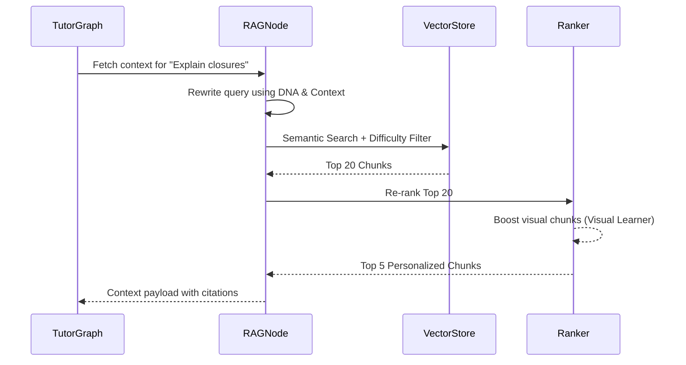

# Behavior-Aware RAG Specification (BARS)

## 1. Purpose
The Behavior-Aware RAG System (BARS) replaces generic information retrieval with a highly personalized context engine. Instead of merely matching keywords to documents, BARS retrieves educational content filtered and ranked by the student's Learning DNA, current Tutor Mode, Learning Context, and past misconceptions. This ensures that a visual learner gets diagram-heavy explanations, while a student prepping for a rigorous exam gets dense, comprehensive material.

## 2. Architecture
BARS acts as a specialized RAG pipeline nested within the Tutor Graph. It utilizes a behavior-aware ranking algorithm post-retrieval.

### Components
- **Ingestion Pipeline**: Processes external educational materials (PDFs, docs, web pages) into the vector store.
- **Retrieval Pipeline**: Executes multi-vector search (semantic + metadata filtering).
- **Behavior-Aware Ranker**: Re-ranks retrieved chunks based on the user's Semantic Memory (Learning DNA) and current state.

## 3. Strategies & Algorithms

### Chunking Strategy
- Semantic chunking (by paragraphs/sections) rather than fixed-token chunking.
- Each chunk must encapsulate a standalone concept.

### Metadata Schema
- `topic`: Extracted domain (e.g., "React", "Calculus").
- `difficulty_level`: 1-5 (Beginner to Advanced).
- `format`: Text, Code, Math, Diagram, Step-by-Step.
- `language`: Technical, layman, specific human language.

### Embedding Strategy
- Use dense vector embeddings (e.g., OpenAI `text-embedding-3-large` or Voyage AI) mapped against the chunk + its metadata. LangChain will be used here solely as the adapter to interface with the Vector Database.

### Retrieval Pipeline
1. **Query Rewriting**: Modify the user's query incorporating their `weak_topics` and `misconceptions`.
2. **Pre-filtering**: Filter by `difficulty_level` (based on user's skill) and `topic`.
3. **Vector Search**: Retrieve Top-K semantic matches.

### Ranking Algorithm
- Re-rank the Top-K results by scoring them against the user's Learning DNA:
  - Match `format` with user's `learning_style` (e.g., boost Diagram chunks for visual learners).
  - Check against past `misconceptions` from Episodic Memory (boost chunks that directly address known gaps).

### Hallucination Prevention & Source Attribution
- Enforce strict grounding prompts: "Answer ONLY using the provided context."
- Attach source metadata (Title, URL, Page Number) to every retrieved chunk and force the LLM to output inline citations [Source: X].

## 4. Database Changes
- Implement a Vector Database (e.g., Pinecone, Qdrant, or pgvector).
- Document store schema for raw source files.

## 5. LangGraph Integration
- **Node**: `BehaviorAwareRAGNode` within the Tutor Graph.
- Input state receives the formulated question, `SemanticMemory`, `EpisodicMemory`, and `LearningContext`.
- Output state appends `retrieved_documents` to the context for the LLM generator.

## 6. API Changes
- `POST /api/v1/rag/ingest`: Upload and ingest new educational material.
- `POST /api/v1/rag/query`: Direct query endpoint for testing the retrieval pipeline.

## 7. Folder Structure
```
app/
  ai/
    rag/
      __init__.py
      ingestion.py        # Chunking and embedding logic
      retriever.py        # Vector search and filtering
      ranker.py           # Behavior-aware re-ranking logic
      prompts.py          # Grounding and query rewrite prompts
```

## 8. Sequence Diagrams



## 9. Acceptance Criteria
- [ ] RAG pipeline correctly filters results based on user difficulty level.
- [ ] Ranking algorithm successfully boosts content types matching the user's Learning DNA.
- [ ] LangChain is strictly isolated to the adapter layer for embedding and vector store operations.
- [ ] The LLM response includes accurate source attributions and refuses to answer out-of-context queries.
