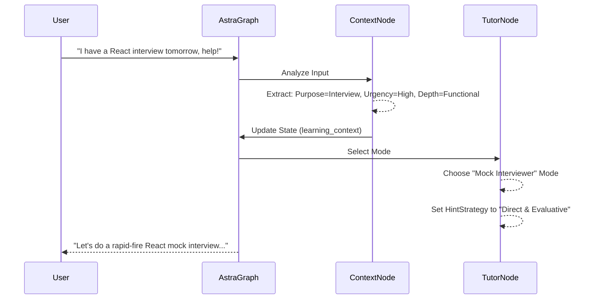

# Learning Context Engine Specification (LCES)

## 1. Purpose
The Learning Context Engine (LCE) determines the "WHY" behind a student's learning session. By understanding the student's motivation, urgency, and goals (e.g., Interview Preparation, Exam, General Learning), Astra can heavily personalize the tutoring experience, adjusting its pedagogical approach dynamically.

## 2. Architecture
The Context Engine operates at the beginning of a learning session and continuously refines its understanding based on user inputs. It outputs a `LearningContext` object that influences downstream AI modules.

### Components
- **Context Detector**: Analyzes initial prompts and session metadata to classify the purpose and urgency.
- **Context Maintainer**: Updates the context if the user shifts goals mid-session.
- **Pedagogy Adapter**: Translates the context into configuration settings for Tutor Mode and Hint Strategy.

### Detected Features
- **Purpose**: Interview Prep, Assignment, Exam, Project, Curiosity, Career Growth, Communication, General Learning.
- **Urgency**: Low, Medium, High.
- **Deadline**: Datetime (if applicable).
- **Expected Depth**: Surface, Functional, Deep, Mastery.
- **Learning Objective**: Specific skill or knowledge target.

## 3. Database Changes
- Add `session_contexts` table:
  - `id`, `session_id`, `purpose`, `urgency`, `deadline`, `expected_depth`, `objective`, `created_at`
- Update `sessions` table:
  - Add `context_id` foreign key.

## 4. LangGraph Integration
- **Node**: `DetectContextNode` runs early in the graph, prior to `SelectTutorModeNode`.
- **State Definition**:
  - `learning_context`: Store the extracted parameters.
- **Influence on Graph**:
  - **Tutor Mode**: e.g., "Exam Prep" might trigger a stricter "Socratic Assessor" mode, while "Curiosity" triggers "Exploratory Guide".
  - **Hint Strategy**: "High Urgency" yields more direct hints; "Low Urgency" yields deeper Socratic questioning.
  - **Curiosity Engine**: Suppressed during high-urgency tasks, elevated during curiosity-driven tasks.
  - **Resource Recommendation**: Suggests cheat sheets for exams, documentation for projects.

## 5. API Changes
- `POST /api/v1/sessions/{session_id}/context`: Manually set or update session context.
- `GET /api/v1/sessions/{session_id}/context`: Retrieve active context.

## 6. Folder Structure
```
app/
  ai/
    context/
      __init__.py
      detector.py         # LLM logic for extracting context
      adapter.py          # Translates context into engine configs
      models.py           # Pydantic models for Context
```

## 7. Sequence Diagrams



## 8. State Transitions
- `START_SESSION` -> `DETECT_CONTEXT`
- `DETECT_CONTEXT` -> `ADAPT_PEDAGOGY`
- `ADAPT_PEDAGOGY` -> `TUTOR_INTERACTION`
- `TUTOR_INTERACTION` -> `DETECT_CONTEXT` (if user indicates shift, e.g., "Actually, let's just build it")

## 9. Acceptance Criteria
- [ ] Engine accurately classifies the session purpose and urgency from natural language inputs.
- [ ] Extracted context correctly adjusts the Tutor Mode and Hint Strategy (e.g., shorter hints for urgent tasks).
- [ ] The context is stored in the database and linked to the active session.
- [ ] If urgency is high, the Curiosity Engine is appropriately muted to maintain focus.
