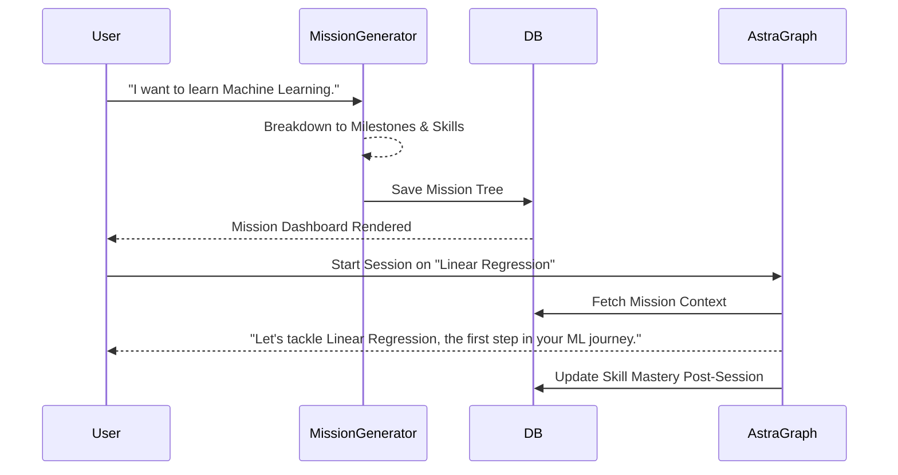

# Learning Mission Engine (LME)

## 1. Purpose
The Learning Mission Engine replaces simple, static goals with dynamic, multi-session learning campaigns. A "Learning Mission" maps out a structured path from a broad objective down to specific skills and sessions. This ensures the student always understands where they are in their overarching journey, providing sustained motivation and clear progression.

## 2. Architecture
The LME establishes a hierarchical data model to track progress across time. It integrates deeply with the Learning Context Engine (to contextualize sessions within a mission) and Episodic Memory (to mark mission milestones).

### Hierarchy Model
1. **Mission**: The grand objective (e.g., "Become a Full-Stack React Developer").
2. **Milestones**: Major checkpoints (e.g., "Master React Hooks", "Build a REST API").
3. **Skills**: Specific competencies required for a milestone (e.g., `useEffect`, `Express.js routing`).
4. **Sessions**: Individual interactions targeting specific skills.
5. **Progress & Completion**: Metrics tracking mastery of skills leading to milestone and mission completion.

## 3. Database Changes
- `learning_missions` table:
  - `id`, `user_id`, `title`, `description`, `status` (active, paused, completed), `created_at`, `completed_at`
- `mission_milestones` table:
  - `id`, `mission_id`, `title`, `order_index`, `status`
- `skills` table:
  - `id`, `milestone_id`, `name`, `mastery_level` (0.0 to 1.0)
- Update `sessions` table:
  - Add `mission_id`, `milestone_id`, `target_skill_id` foreign keys.

## 4. LangGraph & System Effects
- **Tutor Modes**: As a user progresses through a Milestone, the Tutor Mode shifts from "Exploratory Guide" (introducing concepts) to "Socratic Assessor" (testing mastery).
- **Challenges**: LME triggers capstone challenges when a Milestone is near completion to prove mastery before moving on.
- **Resources**: Recommends mission-aligned resources (e.g., full project repos for later milestones).
- **Reflection**: End-of-session reflection ties back to the Mission ("How did learning `useEffect` bring you closer to becoming a Full-Stack Developer?").
- **Learning DNA**: Skill mastery updates the `strong_topics` and `weak_topics` arrays in Semantic Memory.

## 5. API Changes
- `POST /api/v1/missions`: Generate a new mission via LLM breakdown.
- `GET /api/v1/missions/{user_id}`: Retrieve active missions and progress trees.
- `PUT /api/v1/missions/{mission_id}/progress`: Manually update progress or mark skills complete.

## 6. Folder Structure
```
app/
  ai/
    missions/
      __init__.py
      generator.py        # LLM logic to break down a Goal into Missions/Milestones
      tracker.py          # Progress evaluation logic
      models.py           # Pydantic models for the hierarchy
```

## 7. State Transitions (Mission Lifecycle)
- `DRAFT` -> `ACTIVE` (User approves generated mission tree)
- `ACTIVE` -> `MILESTONE_IN_PROGRESS`
- `MILESTONE_IN_PROGRESS` -> `MILESTONE_REVIEW` (Capstone challenge triggered)
- `MILESTONE_REVIEW` -> `MILESTONE_COMPLETED`
- `MILESTONE_COMPLETED` -> `MISSION_COMPLETED` (When all milestones are done)

## 8. Sequence Diagrams



## 9. Acceptance Criteria
- [ ] LLM successfully breaks down a high-level user goal into a structured tree of Milestones and Skills.
- [ ] Active session context accurately reflects the current position within the Mission.
- [ ] Skill mastery is quantifiable and visually trackable for the user.
- [ ] Completion of skills automatically updates the Milestone progress, cascading up to the Mission level.
