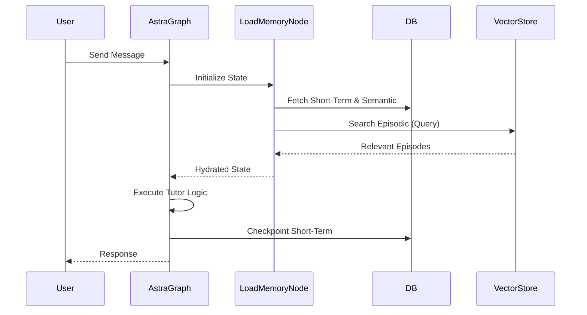

# Memory Architecture Specification (MAS)

## 1. Purpose
The Memory Architecture Specification defines Astra's comprehensive memory system. This architecture separates memory into distinct layers (Short-Term, Working, Episodic, Semantic) to enable long-term intelligence, personalized interactions, and continuity across learning sessions, effectively moving Astra from a stateless chatbot to a lifelong AI Behavioral Learning Companion.

## 2. Architecture
The architecture comprises four distinct layers:

1. **Short-Term Memory**: Stores the current conversation context (messages, tool calls, intermediate reasoning steps). Highly transient.
2. **Working Memory**: Holds recent sessions, currently active concepts, and the immediate learning objective. Acts as the bridging context for ongoing multi-session tasks.
3. **Episodic Memory**: A long-term store of significant learning events, such as when a user struggles, overcomes a misconception, achieves a breakthrough, or completes a meaningful reflection.
4. **Semantic Memory**: Persistent state storing the user's Learning DNA (learning preferences, explanation style, language preference, strengths, weaknesses, and behavioral traits).

## 3. Database Changes
New tables and updates to support the memory layers:

- `short_term_memory`: (Likely handled by LangGraph's `BaseCheckpointSaver` in PostgreSQL/Redis).
  - `thread_id`, `checkpoint_id`, `state`, `timestamp`
- `working_memory`:
  - `user_id`, `active_concepts` (JSON), `current_learning_objective_id`, `last_active_at`
- `episodic_memory`:
  - `id`, `user_id`, `event_type` (e.g., 'breakthrough', 'misconception', 'achievement'), `description`, `context_snapshot` (JSON), `timestamp`
- `semantic_memory`:
  - `user_id`, `learning_style`, `explanation_style`, `language_preference`, `strong_topics` (Array), `weak_topics` (Array), `behavioral_traits` (JSON), `updated_at`

### Update & Retrieval Rules
- **Short-Term**: Updated on every message turn. Retrieved at the start of a turn. Flushed/archived when the session ends.
- **Working**: Updated when a session starts/ends or objective changes. Retrieved at session initialization.
- **Episodic**: Appended asynchronously during "Reflection" phases or when specific trigger conditions are met (e.g., student solves a problem after 3 failed attempts). Retrieved using semantic search (vector embeddings of the event description) when relevant topics are discussed.
- **Semantic**: Updated via the Meta-Learning Engine and periodic DNA reviews. Retrieved heavily during prompt construction to tailor Astra's persona and hints.

### Expiration Policy
- **Short-Term**: Expires after session termination or inactivity timeout (e.g., 24 hours).
- **Working**: Decays slowly; concepts fall out of active working memory if untouched for 7 days.
- **Episodic**: Never expires, but relevance degrades if superseded by newer insights.
- **Semantic**: Never expires; overwrites/evolves based on continuous learning.

## 4. LangGraph Integration
- **State Definition**: The LangGraph `State` object will include `short_term_context`, `working_memory`, `episodic_context`, and `semantic_profile`.
- **Memory Nodes**:
  - `LoadMemoryNode`: Runs at the start of the graph to hydrate the state from DB/Vector Store.
  - `UpdateMemoryNode`: Runs at the end of a session or at key milestones to write back to Episodic/Semantic memory.
- **Checkpointing**: LangGraph's built-in checkpointer will handle Short-Term memory.

## 5. API Changes
- `GET /api/v1/memory/semantic/{user_id}`: Retrieve user's Learning DNA.
- `PUT /api/v1/memory/semantic/{user_id}`: Manually update preferences.
- `GET /api/v1/memory/episodic/{user_id}?topic={topic}`: Retrieve relevant past episodes.
- `POST /api/v1/memory/episodic`: Log a new learning event.
- `GET /api/v1/memory/working/{user_id}`: Get current active concepts.

## 6. Folder Structure
```
app/
  ai/
    memory/
      __init__.py
      short_term.py      # LangGraph checkpointer integration
      working.py         # Working memory manager
      episodic.py        # Episodic memory RAG and schema
      semantic.py        # Learning DNA and trait manager
      prompts.py         # Memory injection prompts
```

## 7. Sequence Diagrams



## 8. State Transitions
- `INIT` -> `HYDRATE_MEMORY`
- `HYDRATE_MEMORY` -> `PROCESS_INPUT`
- `PROCESS_INPUT` -> `EVALUATE_LEARNING`
- `EVALUATE_LEARNING` -> `UPDATE_MEMORY` (if breakthrough or session end)
- `UPDATE_MEMORY` -> `AWAIT_USER`

## 9. Acceptance Criteria
- [ ] LangGraph state successfully hydrates Short, Working, Episodic, and Semantic memory components before generating a response.
- [ ] Episodic memories are successfully embedded and retrieved via similarity search.
- [ ] Semantic memory reflects accurate user preferences and persists across sessions.
- [ ] Expiration policies correctly purge or archive old short-term memory.
