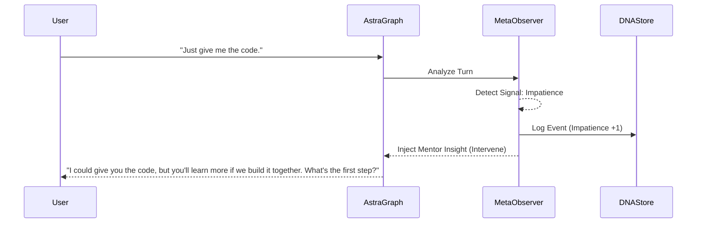

# Meta-Learning Specification (MLS)

## 1. Purpose
The Meta-Learning Engine is responsible for teaching students *how* to learn, not just *what* to learn. It observes the student's behavior over time, identifies anti-patterns (e.g., asking for answers immediately, skipping documentation), and intervenes with personalized coaching advice to improve their study habits, problem-solving skills, and resilience.

## 2. Architecture
The Meta-Learning Engine operates asynchronously or as a parallel diagnostic node during the session, and prominently during the "Reflection" phase.

### Components
- **Behavior Signal Detector**: Analyzes interaction logs for specific behavioral patterns.
- **Coaching Rule Engine**: Maps detected signals to specific mentoring interventions.
- **DNA Updater**: Mutates the user's Semantic Memory (Learning DNA) based on persistent behavior.

### Detected Behavior Signals
- **Impatience**: Asking for direct answers repeatedly without attempting the problem.
- **Poor Debugging**: Pasting error messages without hypothesis or context.
- **Surface Skimming**: Never reading documentation links provided by the Tutor.
- **Avoidance**: Abandoning difficult problems or rapidly switching contexts when challenged.
- **Skipping Reflection**: Exiting sessions immediately after solving the problem without reviewing the "why".

## 3. Database Changes
- `meta_learning_events` table:
  - `id`, `user_id`, `session_id`, `signal_type`, `intensity` (1-10), `timestamp`
- Update `semantic_memory`:
  - `behavioral_traits` (JSON) to track long-term tendencies (e.g., "high_impatience", "strong_resilience").

## 4. LangGraph Integration
- **Node**: `MetaLearningObserverNode`.
- Operates in a parallel execution branch within the graph, analyzing the state of the conversation without directly blocking the primary tutor response, unless an intervention threshold is crossed.
- **Intervention**: If a threshold is crossed (e.g., 3rd time asking for an answer), it injects a `mentor_insight` into the state. The Tutor Node consumes this insight to pivot from teaching the topic to coaching the behavior.

## 5. Coaching Rules & DNA Updates
- **Rule Example**: IF `Impatience` > Threshold THEN Switch Tutor Mode to `Strict Socratic` AND deliver Mentor Insight: "I notice we're rushing to the solution. Let's step back—what's your hypothesis?"
- **DNA Update**: If `Poor Debugging` is detected across 5 sessions, update `behavioral_traits.debugging_habit` = `weak`. Future sessions will automatically provide more scaffolding for debugging tasks.

## 6. API Changes
- `GET /api/v1/meta-learning/insights/{user_id}`: Retrieve long-term behavioral insights for the dashboard.
- `POST /api/v1/meta-learning/events`: Manually log an external behavioral event.

## 7. Folder Structure
```
app/
  ai/
    meta_learning/
      __init__.py
      detector.py         # Pattern recognition logic
      rules.py            # Coaching intervention rules
      dna_updater.py      # Logic for updating Semantic Memory
```

## 8. Sequence Diagrams



## 9. Acceptance Criteria
- [ ] System reliably detects specified behavioral anti-patterns from conversational text and tool usage.
- [ ] Interventions (Mentor Insights) are generated and successfully pivot the conversation without breaking the topic context.
- [ ] Persistent behaviors result in permanent updates to the user's Learning DNA.
- [ ] Meta-Learning events are correctly stored for dashboard visualization.
