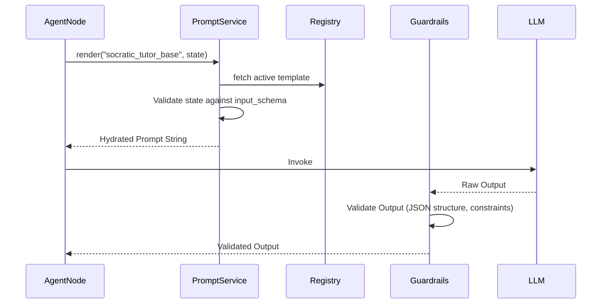

# Prompt Orchestration Specification (POS)

## 1. Purpose
The Prompt Orchestration Specification defines a centralized architecture for managing all system prompts used by Astra. By moving prompts out of Python source code and into a managed registry, we enable proper versioning, A/B testing, standardized variable injection, and rigorous evaluation of prompt effectiveness without requiring codebase deployments.

## 2. Architecture
The architecture centers around a Prompt Registry that decouples the application logic (LangGraph/Agents) from the prompt text.

### Components
- **Prompt Registry**: A centralized store (file-system based with DB-backed overrides) containing all templates.
- **Prompt Versioning**: Semantic versioning (e.g., v1.2.0) for every prompt.
- **Prompt Templates**: Jinja2 or similar templating engine supporting conditional logic and variable injection.
- **Variables**: Strictly typed input schemas for every prompt (e.g., `user_name`, `misconceptions_list`).
- **Prompt Guardrails**: Input/output validation rules (e.g., ensuring the prompt doesn't bypass safety filters, ensuring output is valid JSON).
- **Evaluation Strategy**: Framework to test prompts against golden datasets before promoting them to production.

## 3. Database Changes
- `prompts` table:
  - `name` (e.g., "socratic_tutor_base"), `description`, `created_at`
- `prompt_versions` table:
  - `id`, `prompt_name`, `version`, `template_text`, `input_schema` (JSON Schema), `is_active`, `created_at`

## 4. LangGraph Integration
- Nodes no longer hardcode strings like `PromptTemplate.from_template("...")`.
- Instead, agents inject the `PromptService`: 
  `prompt = PromptService.get("socratic_tutor_base", version="latest").render(**state)`

## 5. API Changes
- `GET /api/v1/prompts`: List available prompts.
- `GET /api/v1/prompts/{name}/versions`: List versions for a prompt.
- `POST /api/v1/prompts/{name}`: Create a new version of a prompt (Admin only).

## 6. Folder Structure
```
app/
  ai/
    prompts/
      registry/
        socratic_tutor.yaml    # Stores prompt text and schema definition
        mentor_coach.yaml
        reflection_trigger.yaml
      service.py               # Prompt loading, caching, and rendering logic
      guardrails.py            # Output parsers and validation
```

### Example YAML Format
```yaml
name: socratic_tutor_base
version: 1.0.0
input_schema:
  learning_dna: string
  active_concepts: list
template: |
  You are an expert Socratic tutor. 
  The student's learning profile is: {{ learning_dna }}
  Focus on these concepts: {{ active_concepts | join(', ') }}
  Do not give the direct answer.
```

## 7. Sequence Diagrams



## 8. Acceptance Criteria
- [ ] No raw prompt strings (longer than a few words) exist inside Python Agent/Node files.
- [ ] All prompts are defined in a centralized YAML/JSON registry or database with versioning.
- [ ] The Prompt Service enforces strict input schema validation before rendering a prompt.
- [ ] Guardrails successfully intercept and reject LLM outputs that violate defined constraints.
- [ ] New prompt versions can be deployed without restarting the application server.
